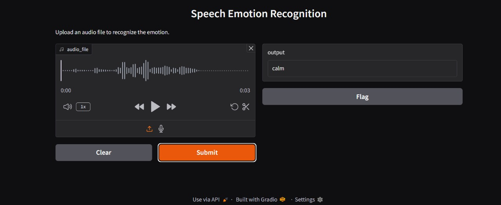

# Voice Emotion Recognition

This project aims to recognize emotions in speech using machine learning techniques. The model uses the **RAVDESS** dataset, which includes audio files with speech samples expressing different emotions. The project extracts audio features (such as MFCC, Chroma, and Mel spectrograms) from these speech files, trains a **Support Vector Classifier (SVC)**, and predicts emotions from input audio files.

## Project Overview

- **Dataset**: RAVDESS Emotional Speech Audio Dataset
- **Features Extracted**: MFCCs, Chroma, Mel spectrogram
- **Model**: Support Vector Classifier (SVC)
- **Interface**: Gradio (for real-time emotion prediction)
- **Emotions**: Calm, Happy, Fearful, Disgust (observed)

## Features

- **Audio Feature Extraction**: The project extracts three key features (MFCC, Chroma, and Mel spectrogram) from the audio files.
- **Model Training**: The model is trained using the Support Vector Classifier (SVC) algorithm.
- **Emotion Prediction**: Users can upload audio files to predict the emotion behind the speech.
- **Gradio Interface**: A simple Gradio interface to upload audio and get emotion predictions.

## Model Performance

The model is trained and evaluated on the dataset with the following results:
- **Accuracy**: Model performance can be tracked by accuracy scores.
- **F1-Score**: Detailed F1 scores for each emotion.
- **Confusion Matrix**: Visualizes the performance of the model using a confusion matrix.

## Project Preview

Below is a preview of the Voice Emotion Recognition project:



## Installation

To run this project, ensure the following dependencies are installed:

```bash
pip install librosa
pip install gradio
pip install scikit-learn
pip install matplotlib
pip install soundfile


